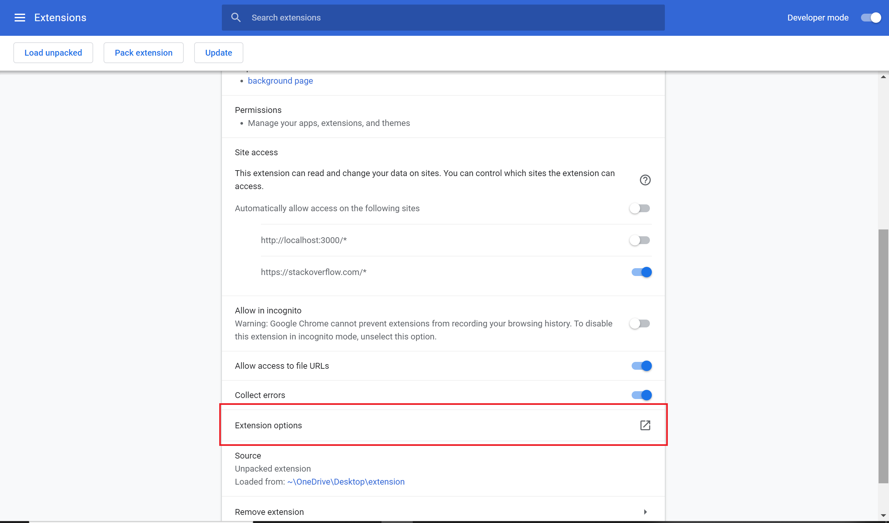
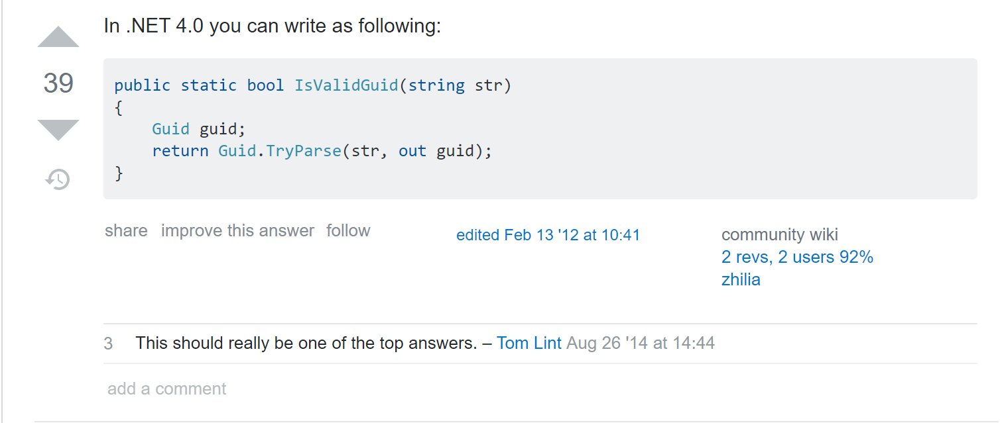
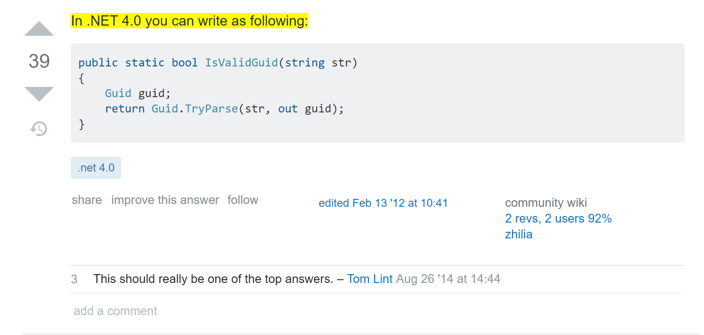
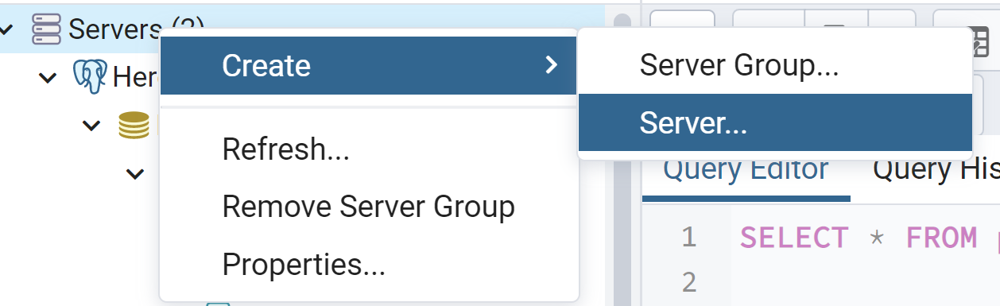
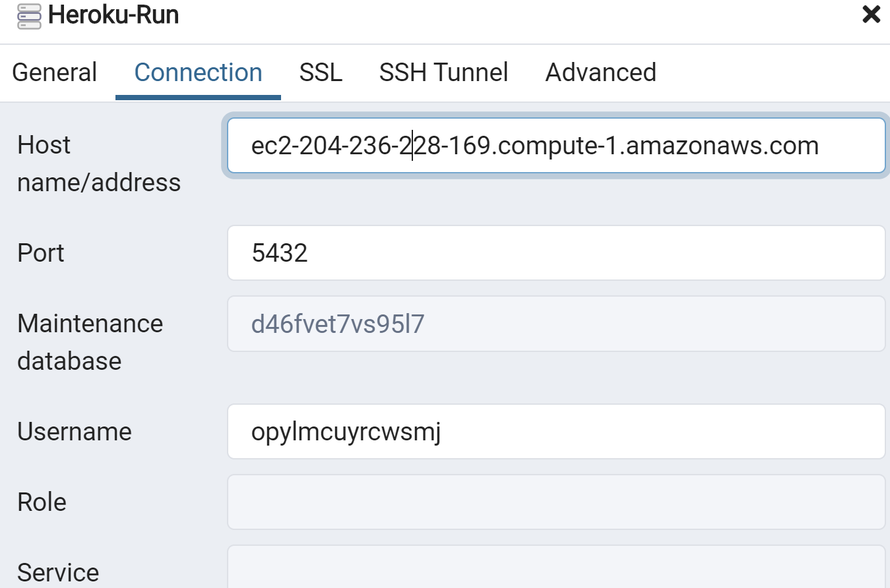
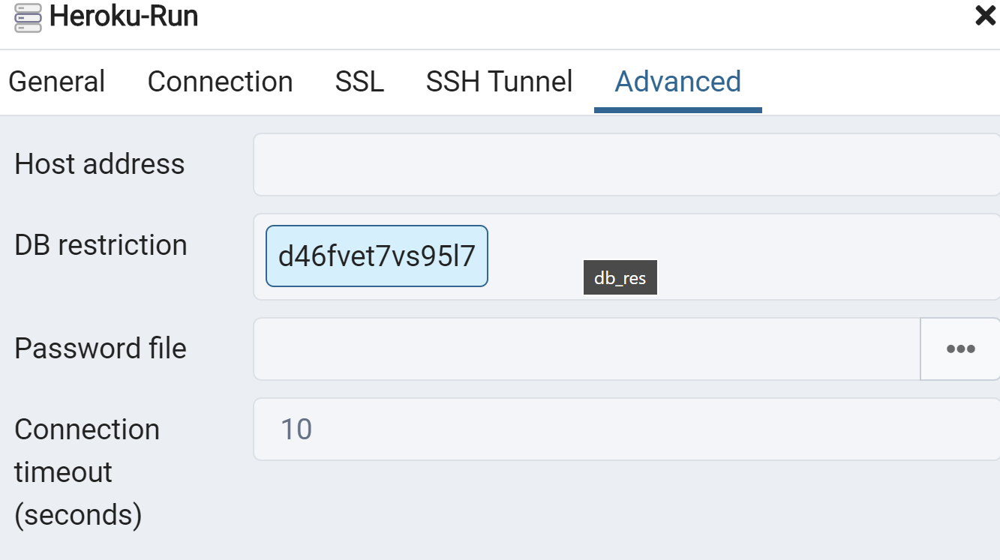
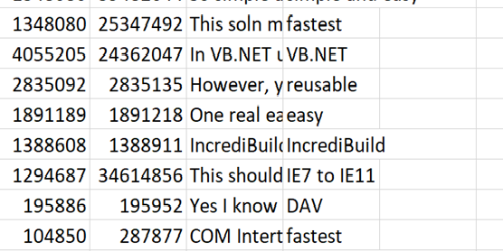
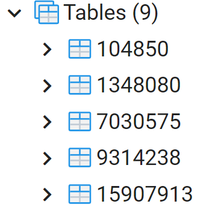
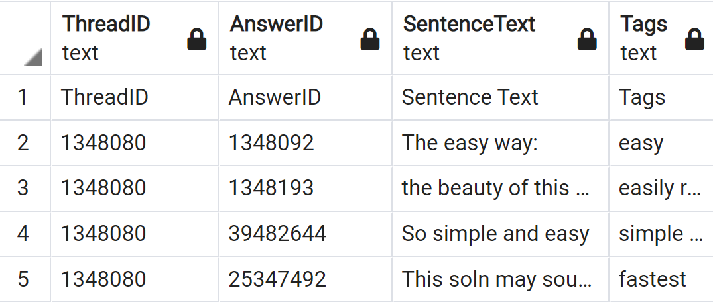

<h1 align="center">
   
   StackOverflow Browser Plugin
</h1>

# Description
<h4>A Chrome Extension that adds tags to Stack Overflow threads</h4>

## Features
<ul> 
  <li> Adds tags onto Stack Overflow thread answers based off the context of the answer </li>
  <li> Highlights important key phrases and words in the answer</li>
  <li> Filter answers by tag </li>
</ul>

## Downloading the Extension
Currently, to install the extension, download all files in the github repo, and save them as a file. Go to chrome://extensions/, and click the “Load Unpacked” button at the top left of the screen. The extension is now applied to the Chrome browser. 

In the future, the extension will be added to the Google Marketplace, and will be installable from there.

Tags should automatically show up on SO pages if applicable.

## Retrieving The CSV
The extension relies on a CSV to get the information about the SO answers. There are two ways to get this CSV: locally, or via an API that can access the CSV hosted on a web server (for now…)

The dropdown menu can be found here:

 

### Locally
Clicking the “extension options” button on chrome://extensions will show a pop-up asking where to get the extension from. Choosing “Local” means that the CSV is retrieved from the extension itself: since inside the extension folder is a copy of the CSV. Whether or not the copy is a previous, outdated version depends on when the extension folder was downloaded. 

Pros: doesn’t require any additional libraries/knowledge of how to use them, don’t have to run server.js every time you plan on using the extension
Cons: CSV on computer may become outdated if a newer version is released

### API
Choosing “API" means that the backend will filter the sentences that need to be highlighted from Stack Overflow page, and the CSV will be retrieved from a web server (Heroku server for now...). 

## Description of Files
<table>
  <tr>
    <th>File</th>
    <th>Description</th>
  </tr>
  <tr>
    <td>Dataset_Sample.csv</td>
    <td>Contains the data about Stack Overflow threads, including what keywords are in the threads, and the respective tags.
    The information in this csv file is formatted as: ThreadId, AnswerID, Key Phrases/Sentences, Tags</td>
  </tr>

  <tr>
    <td>pageSource.js</td>
    <td>The content script of the extension. Reads the HTML of the Stack Overflow page, and then highlights and injects the right tags into it. It gets the tags from...</td>
  </tr>
    <tr>
    <td>background.js</td>
    <td>In local mode, reads Dataset_Sample.csv, and tells pageSource.js the right tags to inject and what to highlight. In API mode, fetchs the data from Heroku web page, and tells pageSource.js the right tags to inject and what to highlight</td>
  </tr>
   <tr>
    <td>excludingAnswers.js</td>
    <td>When the user clicks on one of the tags at the top of the page, all answers that do not contain that tag will be hidden, so the user can find what they're looking for faster!</td>
  </tr>
  <tr>
    <td>manifest.json</td>
    <td>Tells Chrome the properties of the extension, including what scripts to run, and which pages to run on.</td>
  </tr>
</table>

## How It Works

Before: 
 
After:

Try it yourself <a href = "https://stackoverflow.com/questions/104850/test-if-string-is-a-guid-without-throwing-exceptions">here</a>!

## Deploy Heroku on local machine (for the current progress)

Install the Heroku Command Line Interface (CLI)
<ul>
  <li>Go https://devcenter.heroku.com/articles/getting-started-with-nodejs#set-up to download CLI</li>
</ul>

Install nodejs, npm and git
<ul>
  <li>Nodejs && Npm: https://nodejs.org/en/download/ </li>
  <li>Git: https://git-scm.com/downloads </li>
</ul>

Clone the repository from git
<ul>
  <li>Use Git to clone infinite-inlet-10555's source code to the local machine. </li>
  <li>$ heroku git:clone -a infinite-inlet-10555</li>
  <li>$ cd infinite-inlet-10555</li>
</ul>

Change the server configuration
<ul>
  <li>"index.js" is the current code of server in Heroku. It works to connect the database ----“Heroku Postgres” to fetch the data and write all of them on Heroku web page. </li>
</ul>

Update the git
<ul>
  <li>After making any changes on the server side, using the following commands to update the git</li>
  <li>$ git add .</li>
  <li>$ git commit -m "My first commit"</li>
</ul>

## Deploy “Heroku Postgres” on local machine (for the current progress)

Install postgresql, pgAdmin is a GUI for postgresql databases
<ul>
  <li>Go https://www.postgresql.org/download/ </li>
</ul>

Right-click the Servers, create--->server
<ul>
  
</ul>

Connect to the Heroku
<ul>
  
  <li>hostname/address: ec2-204-236-228-169.compute-1.amazonaws.com</li>
  <li>Port: 5432</li>
  <li>Maintenance database: d46fvet7vs95l7</li>
  <li>Username: opylmcuyrcwsmj</li>
</ul>

Setting in "Advanced"
<ul>
  
  <li>DB restriction: d46fvet7vs95l7</li>
</ul>

## The structure of “Heroku Postgres”(for now)

The data in Dataset_Sample.csv has been transformed into the different tables by their thread Id.
<ul>
  Before:
  In Postgres:
</ul>

The data is stored in the following structure. 
<ul>
  
</ul>

## Login to the heroku
Go to https://dashboard.heroku.com/apps
<li>Username: demonlitioncap@gmail.com</li>
<li>Passwords: qweasd665</li>

## Deploy Heroku on local machine (from the begining)
This is the guideline about how to deploy on local machine for a new account. Go to "https://devcenter.heroku.com/articles/getting-started-with-nodejs"

## Next Steps
The current next steps (as of December 2020…) will be:

<ul>
### Installing the extension directly on the Chrome Marketplace:
<li>There is an “Issue” on Github with all the relevant information pertaining to putting the extension on the Chrome marketplace. </li>
</ul>
